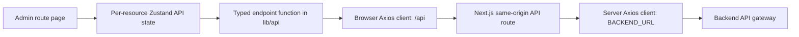

# Admin Application Architecture

This document describes the current architecture of the `admin` application. It is intended to help engineers and coding agents make changes in the correct layer and preserve the existing data flow.

## Technology and Runtime

- Next.js App Router, React, and TypeScript.
- Tailwind CSS with customized shadcn/Base UI components in `src/components/ui`.
- Axios for HTTP requests.
- Zustand for authenticated-user state and API-resource state.
- The admin app listens on port `3001` by default. In local development, its API gateway is expected at `http://localhost:3000`.

Environment configuration is documented in `README.md`. Development reads `BACKEND_URL` from `.env.development`. Staging scripts load `.env.staging` through Node's `--env-file` option. Production should receive `BACKEND_URL` from the deployment environment or `.env.production`. The staging and production example files contain placeholder URLs and must be replaced before use.

## Source Layout

```text
src/
├── app/
│   ├── (admin)/                 # Authenticated dashboard and independent business pages
│   ├── api/                     # Same-origin API routes and backend proxy
│   ├── login/                   # Login page
│   ├── globals.css
│   └── layout.tsx               # Root document and global providers/styles
├── components/
│   ├── admin/                   # Admin shell, navigation, page headers and feedback
│   ├── customs/
│   │   ├── dialogs/             # Business editor and password dialogs
│   │   └── tables/              # Generic app table and inventory row renderers
│   ├── pages/                   # Page-level compositions, currently dashboard
│   └── ui/                      # Shared customized shadcn/Base UI primitives
├── hooks/                       # Small reusable UI hooks
├── constants/                   # Shared application constants, including API prefixes
└── lib/
    ├── api/                     # Axios clients, endpoint functions, request/response types
    ├── state/                   # Zustand API-state managers and invalidation coordinator
    ├── navigation.ts            # Admin sections, navigation links and page metadata
    ├── store.ts                 # Authenticated-user Zustand store
    ├── types.ts                 # Shared section types
    └── utils.ts                 # Shared utilities
```

## Route and Component Ownership

The root layout is `src/app/layout.tsx`. Authenticated routes live in the `(admin)` route group and share `src/app/(admin)/layout.tsx`, which wraps each page in `AdminShell`.

Each business route owns its page layout, transient controls, filters, and initial resource load. The current routes are:

| Route | Page | Resource state |
| --- | --- | --- |
| `/` | `src/app/(admin)/page.tsx` → `DashboardPage` | `dashboardApiState` |
| `/products` | `src/app/(admin)/products/page.tsx` | `productsApiState` |
| `/lots` | `src/app/(admin)/lots/page.tsx` | `lotsApiState` |
| `/stock` | `src/app/(admin)/stock/page.tsx` | `stockApiState` |
| `/receipts` | `src/app/(admin)/receipts/page.tsx` | `receiptsApiState` |
| `/issues` | `src/app/(admin)/issues/page.tsx` | `issuesApiState` |
| `/suppliers` | `src/app/(admin)/suppliers/page.tsx` | `suppliersApiState` |
| `/movements` | `src/app/(admin)/movements/page.tsx` | `movementsApiState` |

Do not consolidate these routes into a single inventory-list page. Shared components should provide reusable presentation or small primitives while each route keeps its own behavior.

## API Request Flow

Browser-side endpoint functions use `src/lib/api/client.ts`. The Axios client has `baseURL: '/api'`, so requests stay on the admin app's origin and include the HttpOnly session cookie. Shared versioned prefixes are defined in `src/constants/api-paths.ts` as `API_PREFIXES.auth` (`/v1/auth`) and `API_PREFIXES.inventory` (`/v1/inventory`). Endpoint functions append resource paths to these constants; for example, `${API_PREFIXES.inventory}/products` requests `/api/v1/inventory/products` from the browser.



`src/app/api/[...path]/route.ts` is the authenticated proxy for inventory and authenticated account endpoints. It reads the `admin_session` cookie, forwards it as a Bearer token, preserves the query string, and forwards JSON request bodies. It allows only the configured inventory resource roots and `/v1/auth/me` or `/v1/auth/change-password`; unsupported paths return 404. Mutating requests also receive origin and JSON content-type checks.

`src/lib/api/server-client.ts` is server-only and uses `BACKEND_URL` (currently defaulting to `http://127.0.0.1:3000`). The proxy appends `/api/` to the forwarded path. Thus `/api/v1/inventory/products` on the admin origin is forwarded to `${BACKEND_URL}/api/v1/inventory/products`.

Login and logout have dedicated Next.js routes:

- `POST /api/auth/login` forwards credentials to the backend, returns the user, and stores the backend token in the `admin_session` HttpOnly cookie.
- `POST /api/auth/logout` deletes the cookie locally.
- Authenticated account and inventory calls go through the catch-all proxy.

Endpoint functions are grouped by business API in `src/lib/api/*.api.ts`. They should use the shared prefixes from `src/constants/api-paths.ts` instead of repeating `/v1/auth` or `/v1/inventory` literals. Request and response types belong in matching `req/<domain>.req.ts` and `res/<domain>.res.ts` files. Only broadly shared response shapes belong in `res/common.res.ts`.

## State and Cache Flow

There are two kinds of Zustand state:

1. `src/lib/store.ts` uses Zustand's React store for the current admin user.
2. `src/lib/state/local-api-state.ts` provides the shared stale-while-revalidate API-resource state using `zustand/vanilla`.

Each API domain has its own manager and exported singleton, such as `productsApiState` in `products-api-state.ts`. A page subscribes with `useStore(resourceState.store, selector)` and calls `resourceState.load(params)` when it mounts or when query parameters change.

`LocalApiState` behavior:

- The latest data is held in an in-memory cache keyed by the API manager's query key. It is not persisted across a full browser reload.
- `load()` publishes matching cached data immediately, marks it stale while fetching, and then replaces it with the API result.
- Requests for the same key are deduplicated while in flight.
- A generation counter prevents responses started before an invalidation or clear from overwriting newer state.
- `invalidate()` drops cached/in-flight entries but retains displayed data as stale until the next load.
- `clear()` removes data and status; logout uses it to remove session-scoped resource data.

Product filters and sorting belong to the products page. The page builds a typed `ProductListQuery`, and `ProductsApiState` uses its serialized query as the cache key. Other page-only search text and open-dialog state remain local React state unless another screen needs to share them.

## Mutations and Invalidation

Business writes are performed by typed functions in `src/lib/api/*.api.ts`, generally from `EditorDialog`. After a successful save, the page closes the editor, calls `invalidateInventoryApiStates(section)`, and reloads its own resource. The invalidation coordinator in `src/lib/state/inventory-api-state.ts` also invalidates the dashboard and lookups.

Current list dependencies invalidated by each mutation:

| Mutation | Lists invalidated |
| --- | --- |
| Products | products, lots, stock, receipts, issues, movements |
| Lots | lots, stock, receipts, issues, movements |
| Stock | stock |
| Receipts | receipts, lots, stock, movements |
| Issues | issues, stock, movements |
| Suppliers | suppliers, receipts |
| Movements | movements |

All rows in this table also invalidate dashboard and lookups. Keep this dependency map accurate when adding or changing mutations. Do not use `router.refresh()` or reload the browser to synchronize a list.

## UI Component Boundaries

- Reuse primitives from `src/components/ui` first. These are customized shadcn/Base UI components, so read their local API before using them.
- `src/components/admin` contains the persistent admin shell, navigation, page header, and loading/error feedback.
- `src/components/customs/tables/app-table.tsx` is the generic responsive table shell. Callers provide headers, row renderers, optional row keys, and table sizing. It should not acquire domain-specific row logic.
- `src/components/customs/tables/app-table-rows.tsx` contains the inventory-specific desktop and mobile row renderers.
- `src/components/customs/dialogs` contains business dialogs that compose shared UI primitives with API operations.

Keep visible interface copy in Vietnamese, label controls for assistive technology, and retain loading, error, empty, and no-results states. Prefer existing components in `src/components/ui` over raw controls or new UI dependencies.

## Agent Workflow

- Read `AGENTS.md` and `SKILL.md` before changing admin UI. Read the installed Next.js documentation under `node_modules/next/dist/docs/` before changing Next.js routes, runtime APIs, or conventions; this repository's installed version is Next.js 16.4.0.
- Follow an existing domain API, state manager, and page as the closest example before adding a new one.
- Keep API request/response types in domain-specific files and keep page-local UI state in the route that owns it.
- Use the resource manager instead of issuing list requests directly from a component when the data is shared or should survive route navigation in the current app session.
- After a successful mutation, invalidate only the affected resource groups through the coordinator.
- Verify import paths after moving files. Use `npm run lint` and `npx tsc --noEmit` from `admin` for static checks when relevant.
- Never edit generated files in `node_modules`.
