# Pharmacy Multi-Branch Inventory & POS — MySQL Database Specification

> **Mục đích:** Tài liệu này là đặc tả dữ liệu chuẩn để một coding agent có thể tạo schema/migration, repository, service và test cho hệ thống **nhà thuốc nhiều chi nhánh**, gồm danh mục hàng hóa, nhập kho, xuất kho, POS bán lẻ, lô/HSD, điều chuyển, kiểm kê, điều chỉnh, trả hàng, giá và audit.
>
> **Database mục tiêu:** MySQL 8.4+ / InnoDB.
>
> **Phiên bản đặc tả:** 1.0  
> **Nguyên tắc:** `inventory_movements` là nguồn sự thật của tồn kho; `inventory_balances` chỉ là read model được cập nhật đồng bộ trong cùng transaction.

## 0. Chỉ dẫn bắt buộc cho coding agent

1. Không tự ý bỏ FK, unique constraint hoặc transaction chỉ để “dễ code”.
2. Không cập nhật trực tiếp tồn kho bằng cách sửa `inventory_balances.on_hand_qty` từ business service. Mọi thay đổi tồn phải tạo `inventory_movements`.
3. Movement đã `POSTED` là bất biến: không sửa `quantity_delta`, `product_id`, `lot_id`, `warehouse_id`, `location_id`, `unit_cost`; nếu sai phải tạo movement đảo (`reversal_of_id`) và movement đúng mới.
4. Tất cả số lượng trong ledger phải là **base unit quantity**.
5. Không dùng `FLOAT`/`DOUBLE` cho tiền, số lượng, conversion factor hoặc thuế.
6. Mọi nghiệp vụ làm thay đổi tồn phải chạy trong **một InnoDB transaction** và lock dòng balance liên quan bằng `SELECT ... FOR UPDATE` hoặc cơ chế tương đương.
7. Tất cả endpoint tạo giao dịch quan trọng phải hỗ trợ `idempotency_key`.
8. Không cho tồn âm trừ khi warehouse được cấu hình `allow_negative_stock = 1`.
9. Với sản phẩm `track_lot = 1`, mọi movement `POSTED` phải có `lot_id` thật. Với sản phẩm không quản lý lot, dùng **synthetic lot** `__NO_LOT__` để balance luôn có `lot_id NOT NULL`.
10. Mọi bảng giao dịch phải giữ snapshot giá/thuế/đơn vị tại thời điểm phát sinh; không join ngược bảng giá hiện tại để tính lại lịch sử.
11. Không hard-delete chứng từ đã posted/completed. Dùng status và reversal/void workflow.
12. Mọi thời gian lưu theo UTC; application chuyển sang timezone chi nhánh khi hiển thị.
13. Chỉ dùng `CASCADE` cho bảng bridge/line khi parent còn ở trạng thái draft và deletion thực sự được cho phép; với master/transaction đã phát sinh lịch sử nên ưu tiên `RESTRICT`.
14. `inventory_balances` phải có optimistic `version` và được cập nhật cùng transaction với ledger.
15. `stock_counts.snapshot_sequence` phải tham chiếu đến `inventory_movements.ledger_seq`, không phải UUID `id`.

---

## 1. Quy ước kỹ thuật MySQL

### 1.1 Engine, charset, collation

```sql
ENGINE=InnoDB
DEFAULT CHARSET=utf8mb4
COLLATE=utf8mb4_0900_ai_ci
```

Nếu mã SKU/barcode/document number cần phân biệt hoa-thường, dùng collation nhị phân hoặc `ascii_bin` riêng cho cột đó.

### 1.2 Kiểu dữ liệu chuẩn

| Loại dữ liệu | Kiểu |
| --- | --- |
| UUIDv7 / UUID | `CHAR(36)` |
| Sequence nội bộ ledger | `BIGINT UNSIGNED AUTO_INCREMENT` |
| Số lượng | `DECIMAL(20,6)` |
| Conversion factor | `DECIMAL(20,6)` |
| Tiền / giá vốn | `DECIMAL(19,4)` |
| Tỷ lệ % | `DECIMAL(9,4)` |
| Ngày sản xuất / HSD | `DATE` |
| Timestamp nghiệp vụ | `DATETIME(6)` UTC |
| Boolean | `TINYINT(1)` |
| Code/status/type | `VARCHAR(32)` hoặc `VARCHAR(64)` + `CHECK` |
| Payload audit | `JSON` |
| IP | `VARCHAR(45)` |

### 1.3 ID

- `id` là UUIDv7 do application sinh.
- UUIDv7 được ưu tiên vì có tính tăng theo thời gian, thuận lợi hơn UUIDv4 cho index.
- Có thể tối ưu sau thành `BINARY(16)`, nhưng V1 dùng `CHAR(36)` để migration/debug dễ và ít phụ thuộc framework.
- `ledger_seq` là sequence riêng phục vụ thứ tự tuyệt đối của ledger và snapshot kiểm kê; không thay thế `id`.

### 1.4 Common columns

Các master table có thể thêm thống nhất:

```sql
created_at DATETIME(6) NOT NULL,
updated_at DATETIME(6) NOT NULL,
created_by CHAR(36) NULL,
updated_by CHAR(36) NULL
```

Không bắt buộc lặp các cột này trong mọi bảng bên dưới nếu framework có base entity, nhưng schema vật lý nên có cho các bảng cần audit.

---

## 2. Các bất biến nghiệp vụ (database invariants)

### INV-01 — Base unit

Mọi stock movement lưu `quantity_delta` theo `products.base_unit_id`.

Ví dụ:

```text
1 hộp = 100 viên
POS bán 2 hộp
sale_lines.quantity = 2
sale_lines.conversion_factor = 100
sale_lines.base_quantity = 200
inventory_movements.quantity_delta = -200
```

### INV-02 — Source of truth

```text
inventory_movements = authoritative stock history
inventory_balances  = current projection / cache
```

Balance có thể rebuild từ ledger. Ledger không được rebuild từ balance.

### INV-03 — Posted movement immutable

Sai ledger:

```text
movement A: +100
```

Sửa đúng:

```text
movement B: -100, reversal_of_id = A
movement C: +120
```

Không `UPDATE A SET quantity_delta = 120`.

### INV-04 — Lot

- Thuốc có `track_lot=1`: bắt buộc lô thật.
- Sản phẩm không quản lý lot: tạo một `inventory_lots` hệ thống với `batch_number='__NO_LOT__'`.
- Nhờ vậy `inventory_balances.lot_id` có thể `NOT NULL`, tránh lỗi unique key với `NULL`.

### INV-05 — FEFO

Allocation mặc định:

```text
expiry_date ASC,
received/created order ASC
```

Loại lô:
- `BLOCKED`
- `QUARANTINED`
- đã hết hạn
- available <= 0

### INV-06 — Negative stock

`available_qty = on_hand_qty - reserved_qty`

Nếu `warehouses.allow_negative_stock = 0` thì mọi posting phải kiểm tra:

```text
available_qty >= required_qty
```

trong transaction có row lock.

### INV-07 — Transfer in transit

Khi `SHIPPED`, hàng không được biến mất khỏi tổng tồn chuỗi. Mỗi organization nên có warehouse ảo:

```text
warehouse_type = TRANSIT
allow_sale = 0
```

Luồng:
1. Source warehouse `-Q`
2. Transit warehouse `+Q`
3. Khi nhận: Transit `-received_qty`
4. Destination `+received_qty`
5. Chênh lệch xử lý bằng adjustment/claim theo policy.

### INV-08 — Idempotency

Unique:

```text
UNIQUE (organization_id, idempotency_key)
```

trên các transaction cần chống retry: sales, goods receipts, adjustments và các command posting tương tự.

### INV-09 — Time

- DB lưu UTC trong `DATETIME(6)`.
- `branches.timezone` lưu IANA timezone, ví dụ `Asia/Ho_Chi_Minh`.
- Document number theo “ngày chi nhánh” nếu business yêu cầu.

### INV-10 — Money snapshot

Các dòng bán/nhập phải giữ:
- unit price tại thời điểm phát sinh
- discount
- tax
- line total
- conversion factor
- base quantity

Không tính lại lịch sử bằng bảng giá hiện tại.

---

## 3. Vocabulary trạng thái/type đề xuất

Không bắt buộc dùng MySQL `ENUM`. Khuyến nghị `VARCHAR + CHECK` để migration linh hoạt.

### Document status

```text
DRAFT
APPROVED
POSTED
CANCELLED
```

### Sale status

```text
DRAFT
COMPLETED
VOIDED
PARTIALLY_REFUNDED
REFUNDED
```

### Transfer status

```text
DRAFT
APPROVED
SHIPPED
IN_TRANSIT
PARTIALLY_RECEIVED
RECEIVED
CANCELLED
```

### Lot status

```text
ACTIVE
BLOCKED
QUARANTINED
CLOSED
```

`EXPIRED` nên được suy ra từ `expiry_date < business_date`; không cần đổi status hàng ngày.

### Warehouse type

```text
SALE
RESERVE
RETURN
QUARANTINE
DAMAGED
TRANSIT
CENTRAL
```

### Movement type

```text
PURCHASE_RECEIPT
SUPPLIER_RETURN
SALE
SALE_RETURN
TRANSFER_OUT
TRANSFER_TRANSIT_IN
TRANSFER_TRANSIT_OUT
TRANSFER_IN
STOCK_ADJUSTMENT
COUNT_ADJUSTMENT
DAMAGE
EXPIRY
REVERSAL
INTERNAL_USE
SAMPLE
```

### Adjustment reason

```text
DAMAGED
EXPIRED
LOST
FOUND
COUNT_DIFFERENCE
DATA_CORRECTION
SAMPLE
INTERNAL_USE
OTHER
```

---

# 4. Chi tiết schema

## 4.1 Tổ chức, chi nhánh và kho

### `organizations`

Tenant/công ty sở hữu toàn bộ dữ liệu. Tất cả dữ liệu business phải được scope theo organization.

| Cột | MySQL | Null | Mặc định | Ý nghĩa / quy tắc |
| --- | --- | --- | --- | --- |
| id | CHAR(36) | NO | — | PK, UUIDv7 |
| code | VARCHAR(64) | NO | — | Mã tenant |
| name | VARCHAR(255) | NO | — | Tên tổ chức |
| timezone | VARCHAR(64) | NO | 'Asia/Ho_Chi_Minh' | Timezone mặc định |
| status | VARCHAR(32) | NO | 'ACTIVE' | ACTIVE/INACTIVE |

**Ràng buộc:**
- PK (`id`)
- UNIQUE (`code`)

**Index đề xuất:**
- `idx_organizations_status(status)`

---

### `branches`

Chi nhánh/cửa hàng vật lý.

| Cột | MySQL | Null | Mặc định | Ý nghĩa / quy tắc |
| --- | --- | --- | --- | --- |
| id | CHAR(36) | NO | — | PK |
| organization_id | CHAR(36) | NO | — | FK organizations.id |
| code | VARCHAR(64) | NO | — | Mã chi nhánh trong organization |
| name | VARCHAR(255) | NO | — | Tên chi nhánh |
| address | VARCHAR(500) | YES | NULL | Địa chỉ |
| phone | VARCHAR(32) | YES | NULL | SĐT |
| timezone | VARCHAR(64) | NO | 'Asia/Ho_Chi_Minh' | IANA timezone |
| status | VARCHAR(32) | NO | 'ACTIVE' | ACTIVE/INACTIVE |

**Ràng buộc:**
- PK (`id`)
- FK organization_id → organizations.id ON DELETE RESTRICT
- UNIQUE (organization_id, code)

**Index đề xuất:**
- `idx_branches_org_status(organization_id, status)`

**Quan hệ:**
- organizations 1 — N branches

---

### `warehouses`

Kho logic/vật lý. Một branch có thể có nhiều kho. Kho `TRANSIT` cấp organization có thể không thuộc branch.

| Cột | MySQL | Null | Mặc định | Ý nghĩa / quy tắc |
| --- | --- | --- | --- | --- |
| id | CHAR(36) | NO | — | PK |
| organization_id | CHAR(36) | NO | — | FK organizations |
| branch_id | CHAR(36) | YES | NULL | FK branches; NULL cho kho central/transit |
| code | VARCHAR(64) | NO | — | Mã kho |
| name | VARCHAR(255) | NO | — | Tên kho |
| warehouse_type | VARCHAR(32) | NO | 'SALE' | SALE/RESERVE/RETURN/QUARANTINE/DAMAGED/TRANSIT/CENTRAL |
| allow_sale | TINYINT(1) | NO | 0 | POS có được xuất bán từ kho này |
| allow_negative_stock | TINYINT(1) | NO | 0 | Mặc định phải = 0 |
| status | VARCHAR(32) | NO | 'ACTIVE' | Trạng thái |

**Ràng buộc:**
- PK (`id`)
- FK organization_id → organizations.id
- FK branch_id → branches.id
- UNIQUE (organization_id, code)

**Index đề xuất:**
- `idx_warehouses_branch(branch_id, status)`
- `idx_warehouses_org_type(organization_id, warehouse_type)`

**Quan hệ:**
- organizations 1 — N warehouses
- branches 1 — N warehouses (branch_id nullable)

---

### `stock_locations`

Bin/kệ/ngăn trong warehouse. V1 vẫn nên có location mặc định để balance không phải dùng location NULL.

| Cột | MySQL | Null | Mặc định | Ý nghĩa / quy tắc |
| --- | --- | --- | --- | --- |
| id | CHAR(36) | NO | — | PK |
| warehouse_id | CHAR(36) | NO | — | FK warehouses |
| code | VARCHAR(64) | NO | — | Mã vị trí |
| name | VARCHAR(255) | NO | — | Tên vị trí |
| location_type | VARCHAR(32) | NO | 'STORAGE' | STORAGE/SELLING/RETURN/QUARANTINE/... |
| status | VARCHAR(32) | NO | 'ACTIVE' | Trạng thái |

**Ràng buộc:**
- PK (`id`)
- FK warehouse_id → warehouses.id
- UNIQUE (warehouse_id, code)

**Index đề xuất:**
- `idx_stock_locations_wh_status(warehouse_id, status)`

**Quan hệ:**
- warehouses 1 — N stock_locations

**Ghi chú triển khai:**
- Mỗi warehouse cần seed ít nhất location `DEFAULT`.

---

## 4.2 Người dùng và phân quyền

### `users`

Tài khoản người dùng nội bộ.

| Cột | MySQL | Null | Mặc định | Ý nghĩa / quy tắc |
| --- | --- | --- | --- | --- |
| id | CHAR(36) | NO | — | PK |
| organization_id | CHAR(36) | NO | — | FK organizations |
| username | VARCHAR(128) | NO | — | Tên đăng nhập |
| full_name | VARCHAR(255) | NO | — | Tên hiển thị |
| status | VARCHAR(32) | NO | 'ACTIVE' | ACTIVE/LOCKED/INACTIVE |

**Ràng buộc:**
- PK (`id`)
- UNIQUE (organization_id, username)

**Index đề xuất:**
- `idx_users_org_status(organization_id, status)`

**Quan hệ:**
- organizations 1 — N users

---

### `roles`

Vai trò RBAC theo organization.

| Cột | MySQL | Null | Mặc định | Ý nghĩa / quy tắc |
| --- | --- | --- | --- | --- |
| id | CHAR(36) | NO | — | PK |
| organization_id | CHAR(36) | NO | — | FK |
| code | VARCHAR(64) | NO | — | Ví dụ CASHIER, PHARMACIST, MANAGER |
| name | VARCHAR(255) | NO | — | Tên role |

**Ràng buộc:**
- UNIQUE (organization_id, code)

**Quan hệ:**
- organizations 1 — N roles

---

### `permissions`

Danh mục permission toàn hệ thống.

| Cột | MySQL | Null | Mặc định | Ý nghĩa / quy tắc |
| --- | --- | --- | --- | --- |
| id | CHAR(36) | NO | — | PK |
| code | VARCHAR(128) | NO | — | Ví dụ inventory.adjust.approve |
| name | VARCHAR(255) | NO | — | Tên |

**Ràng buộc:**
- UNIQUE (code)

---

### `user_roles`

Bridge N-N giữa users và roles.

| Cột | MySQL | Null | Mặc định | Ý nghĩa / quy tắc |
| --- | --- | --- | --- | --- |
| id | CHAR(36) | NO | — | PK |
| user_id | CHAR(36) | NO | — | FK users |
| role_id | CHAR(36) | NO | — | FK roles |

**Ràng buộc:**
- UNIQUE (user_id, role_id)
- FKs ON DELETE CASCADE

**Index đề xuất:**
- `idx_user_roles_role(role_id, user_id)`

**Quan hệ:**
- users N — N roles qua user_roles

---

### `role_permissions`

Bridge N-N roles ↔ permissions.

| Cột | MySQL | Null | Mặc định | Ý nghĩa / quy tắc |
| --- | --- | --- | --- | --- |
| id | CHAR(36) | NO | — | PK |
| role_id | CHAR(36) | NO | — | FK roles |
| permission_id | CHAR(36) | NO | — | FK permissions |

**Ràng buộc:**
- UNIQUE (role_id, permission_id)
- FKs ON DELETE CASCADE

**Quan hệ:**
- roles N — N permissions qua role_permissions

---

### `user_branch_access`

Giới hạn user được thao tác/xem những branch nào.

| Cột | MySQL | Null | Mặc định | Ý nghĩa / quy tắc |
| --- | --- | --- | --- | --- |
| id | CHAR(36) | NO | — | PK |
| user_id | CHAR(36) | NO | — | FK users |
| branch_id | CHAR(36) | NO | — | FK branches |

**Ràng buộc:**
- UNIQUE (user_id, branch_id)
- FKs ON DELETE CASCADE

**Quan hệ:**
- users N — N branches qua user_branch_access

---

## 4.3 Danh mục sản phẩm

### `categories`

Cây phân loại hàng hóa.

| Cột | MySQL | Null | Mặc định | Ý nghĩa / quy tắc |
| --- | --- | --- | --- | --- |
| id | CHAR(36) | NO | — | PK |
| organization_id | CHAR(36) | NO | — | FK |
| name | VARCHAR(255) | NO | — | Tên danh mục |
| parent_id | CHAR(36) | YES | NULL | Self FK để tạo cây |

**Ràng buộc:**
- FK parent_id → categories.id ON DELETE RESTRICT

**Index đề xuất:**
- `idx_categories_org_parent(organization_id, parent_id)`

**Quan hệ:**
- categories 1 — N categories (self hierarchy)
- categories 1 — N products

---

### `manufacturers`

Nhà sản xuất hàng hóa/dược phẩm.

| Cột | MySQL | Null | Mặc định | Ý nghĩa / quy tắc |
| --- | --- | --- | --- | --- |
| id | CHAR(36) | NO | — | PK |
| organization_id | CHAR(36) | NO | — | FK |
| name | VARCHAR(255) | NO | — | Tên |
| country | VARCHAR(128) | YES | NULL | Quốc gia |

**Ràng buộc:**
- UNIQUE (organization_id, name)

**Quan hệ:**
- manufacturers 1 — N products
- manufacturers 1 — N inventory_lots

---

### `units`

Danh mục đơn vị tính dùng chung.

| Cột | MySQL | Null | Mặc định | Ý nghĩa / quy tắc |
| --- | --- | --- | --- | --- |
| id | CHAR(36) | NO | — | PK |
| code | VARCHAR(32) | NO | — | VIEN/HOP/VI/CHAI/... |
| name | VARCHAR(128) | NO | — | Tên |

**Ràng buộc:**
- UNIQUE (code)

---

### `products`

Master sản phẩm. Chứa thuộc tính pharma cơ bản và cấu hình quản lý tồn.

| Cột | MySQL | Null | Mặc định | Ý nghĩa / quy tắc |
| --- | --- | --- | --- | --- |
| id | CHAR(36) | NO | — | PK |
| organization_id | CHAR(36) | NO | — | FK |
| sku | VARCHAR(64) | NO | — | SKU nội bộ |
| name | VARCHAR(255) | NO | — | Tên hàng |
| short_name | VARCHAR(255) | YES | NULL | Tên ngắn trên POS |
| category_id | CHAR(36) | YES | NULL | FK categories |
| manufacturer_id | CHAR(36) | YES | NULL | FK manufacturers |
| product_type | VARCHAR(32) | NO | 'MEDICINE' | MEDICINE/SUPPLEMENT/COSMETIC/DEVICE/OTHER |
| active_ingredient | VARCHAR(500) | YES | NULL | Hoạt chất tóm tắt |
| strength | VARCHAR(128) | YES | NULL | Hàm lượng |
| dosage_form | VARCHAR(128) | YES | NULL | Dạng bào chế |
| registration_number | VARCHAR(128) | YES | NULL | Số đăng ký |
| prescription_type | VARCHAR(32) | YES | NULL | RX/OTC/OTHER |
| track_lot | TINYINT(1) | NO | 1 | Quản lý lô |
| track_expiry | TINYINT(1) | NO | 1 | Quản lý HSD |
| base_unit_id | CHAR(36) | NO | — | FK units; đơn vị gốc của inventory |
| vat_rate | DECIMAL(9,4) | NO | 0 | Thuế suất snapshot mặc định |
| status | VARCHAR(32) | NO | 'ACTIVE' | ACTIVE/INACTIVE |

**Ràng buộc:**
- UNIQUE (organization_id, sku)
- FK base_unit_id → units.id
- CHECK (vat_rate >= 0)

**Index đề xuất:**
- `idx_products_org_name(organization_id, name)`
- `idx_products_org_category(organization_id, category_id, status)`
- `idx_products_registration(organization_id, registration_number)`

**Quan hệ:**
- categories 1 — N products
- manufacturers 1 — N products
- units 1 — N products qua base_unit_id

**Ghi chú triển khai:**
- Nếu nhiều hoạt chất cấu trúc phức tạp, V2 nên tách `product_active_ingredients`.

---

### `product_units`

Các đơn vị đóng gói/bán/nhập của product và hệ số về base unit.

| Cột | MySQL | Null | Mặc định | Ý nghĩa / quy tắc |
| --- | --- | --- | --- | --- |
| id | CHAR(36) | NO | — | PK |
| product_id | CHAR(36) | NO | — | FK products |
| unit_id | CHAR(36) | NO | — | FK units |
| conversion_factor | DECIMAL(20,6) | NO | 1 | 1 unit này = factor × base unit |
| is_base_unit | TINYINT(1) | NO | 0 | Đánh dấu base |
| allow_purchase | TINYINT(1) | NO | 1 | Cho nhập |
| allow_sale | TINYINT(1) | NO | 1 | Cho bán |

**Ràng buộc:**
- UNIQUE (product_id, unit_id)
- CHECK (conversion_factor > 0)
- Application phải đảm bảo đúng 1 product_unit có is_base_unit=1 và conversion_factor=1

**Index đề xuất:**
- `idx_product_units_product(product_id, allow_sale, allow_purchase)`

**Quan hệ:**
- products 1 — N product_units
- units 1 — N product_units

---

### `product_barcodes`

Barcode có thể gắn theo đơn vị đóng gói.

| Cột | MySQL | Null | Mặc định | Ý nghĩa / quy tắc |
| --- | --- | --- | --- | --- |
| id | CHAR(36) | NO | — | PK |
| product_id | CHAR(36) | NO | — | FK products |
| product_unit_id | CHAR(36) | YES | NULL | FK product_units; NULL nếu barcode không gắn packaging |
| barcode | VARCHAR(128) | NO | — | EAN/UPC/internal |
| barcode_type | VARCHAR(32) | YES | NULL | EAN13/UPC/INTERNAL/... |
| is_primary | TINYINT(1) | NO | 0 | Barcode chính |
| status | VARCHAR(32) | NO | 'ACTIVE' | Trạng thái |

**Ràng buộc:**
- UNIQUE (product_id, barcode)

**Index đề xuất:**
- `idx_product_barcodes_lookup(barcode, status)`
- `idx_product_barcodes_unit(product_unit_id)`

**Quan hệ:**
- products 1 — N product_barcodes
- product_units 1 — N product_barcodes

**Ghi chú triển khai:**
- Không unique `barcode` toàn database vì cùng EAN có thể xuất hiện ở nhiều organization.

---

## 4.4 Đối tác

### `suppliers`

Nhà cung cấp.

| Cột | MySQL | Null | Mặc định | Ý nghĩa / quy tắc |
| --- | --- | --- | --- | --- |
| id | CHAR(36) | NO | — | PK |
| organization_id | CHAR(36) | NO | — | FK |
| code | VARCHAR(64) | NO | — | Mã NCC |
| name | VARCHAR(255) | NO | — | Tên |
| phone | VARCHAR(32) | YES | NULL | SĐT |
| status | VARCHAR(32) | NO | 'ACTIVE' | Trạng thái |

**Ràng buộc:**
- UNIQUE (organization_id, code)

**Index đề xuất:**
- `idx_suppliers_org_name(organization_id, name)`

---

### `customers`

Khách hàng bán lẻ/thành viên.

| Cột | MySQL | Null | Mặc định | Ý nghĩa / quy tắc |
| --- | --- | --- | --- | --- |
| id | CHAR(36) | NO | — | PK |
| organization_id | CHAR(36) | NO | — | FK |
| code | VARCHAR(64) | YES | NULL | Mã thành viên |
| name | VARCHAR(255) | YES | NULL | Tên; có thể null cho khách vãng lai |
| phone | VARCHAR(32) | YES | NULL | SĐT |
| customer_group | VARCHAR(64) | YES | NULL | Nhóm giá/thành viên |
| status | VARCHAR(32) | NO | 'ACTIVE' | Trạng thái |

**Ràng buộc:**
- UNIQUE (organization_id, code) nếu code không null

**Index đề xuất:**
- `idx_customers_phone(organization_id, phone)`
- `idx_customers_name(organization_id, name)`

---

## 4.5 Tồn kho lõi — trung tâm hệ thống

### `inventory_lots`

Định danh lô/batch của một sản phẩm. HSD thuộc lot, không thuộc product.

| Cột | MySQL | Null | Mặc định | Ý nghĩa / quy tắc |
| --- | --- | --- | --- | --- |
| id | CHAR(36) | NO | — | PK |
| organization_id | CHAR(36) | NO | — | FK |
| product_id | CHAR(36) | NO | — | FK products |
| batch_number | VARCHAR(128) | NO | — | Mã lô; `__NO_LOT__` cho synthetic lot |
| manufacturing_date | DATE | YES | NULL | NSX |
| expiry_date | DATE | YES | NULL | HSD |
| manufacturer_id | CHAR(36) | YES | NULL | FK manufacturers |
| status | VARCHAR(32) | NO | 'ACTIVE' | ACTIVE/BLOCKED/QUARANTINED/CLOSED |

**Ràng buộc:**
- UNIQUE (organization_id, product_id, batch_number)
- CHECK (expiry_date IS NULL OR manufacturing_date IS NULL OR expiry_date >= manufacturing_date)

**Index đề xuất:**
- `idx_lots_product_expiry(product_id, status, expiry_date)`
- `idx_lots_org_expiry(organization_id, expiry_date, status)`

**Quan hệ:**
- products 1 — N inventory_lots
- manufacturers 1 — N inventory_lots

---

### `inventory_movements`

Immutable stock ledger. Đây là bảng quan trọng nhất của hệ thống.

| Cột | MySQL | Null | Mặc định | Ý nghĩa / quy tắc |
| --- | --- | --- | --- | --- |
| id | CHAR(36) | NO | — | PK UUIDv7 |
| ledger_seq | BIGINT UNSIGNED | NO | AUTO_INCREMENT | Unique sequence tuyệt đối phục vụ snapshot |
| organization_id | CHAR(36) | NO | — | FK |
| branch_id | CHAR(36) | YES | NULL | Branch ngữ cảnh; có thể NULL cho TRANSIT central |
| warehouse_id | CHAR(36) | NO | — | Kho bị tác động |
| location_id | CHAR(36) | NO | — | Vị trí bị tác động |
| product_id | CHAR(36) | NO | — | Sản phẩm |
| lot_id | CHAR(36) | NO | — | Lô thật hoặc synthetic `__NO_LOT__` |
| movement_type | VARCHAR(32) | NO | — | Loại biến động |
| quantity_delta | DECIMAL(20,6) | NO | — | Số có dấu theo BASE UNIT |
| unit_cost | DECIMAL(19,4) | YES | NULL | Giá vốn/base unit tại thời điểm posting |
| source_type | VARCHAR(64) | NO | — | Tên nguồn: SALE/GOODS_RECEIPT/... |
| source_id | CHAR(36) | NO | — | ID chứng từ nguồn |
| source_line_id | CHAR(36) | YES | NULL | ID dòng nguồn |
| reference_no | VARCHAR(128) | YES | NULL | Số chứng từ hiển thị |
| occurred_at | DATETIME(6) | NO | — | Thời điểm nghiệp vụ |
| posted_at | DATETIME(6) | NO | — | Thời điểm ledger được post |
| created_by | CHAR(36) | YES | NULL | FK users |
| device_id | CHAR(36) | YES | NULL | POS/device nếu có |
| idempotency_key | VARCHAR(128) | YES | NULL | Chống duplicate command |
| reversal_of_id | CHAR(36) | YES | NULL | Self FK tới movement bị đảo |
| note | VARCHAR(1000) | YES | NULL | Ghi chú |

**Ràng buộc:**
- PK (`id`)
- UNIQUE (`ledger_seq`)
- CHECK (quantity_delta <> 0)
- FK reversal_of_id → inventory_movements.id ON DELETE RESTRICT
- Các FK master đều ON DELETE RESTRICT
- Không UPDATE/DELETE movement đã post ở application/service layer; có thể thêm DB trigger nếu muốn hard guard

**Index đề xuất:**
- `idx_movements_balance(warehouse_id, location_id, product_id, lot_id, ledger_seq)`
- `idx_movements_product_time(organization_id, product_id, occurred_at)`
- `idx_movements_source(source_type, source_id, source_line_id)`
- `idx_movements_reference(organization_id, reference_no)`
- `idx_movements_reversal(reversal_of_id)`
- `idx_movements_posted(organization_id, posted_at, ledger_seq)`

**Quan hệ:**
- organizations/branches/warehouses/stock_locations/products/inventory_lots/users 1 — N inventory_movements
- inventory_movements 1 — 0..N inventory_movements qua reversal_of_id

**Ghi chú triển khai:**
- `ledger_seq` là cải tiến bắt buộc so với ERD hình để snapshot kiểm kê có thứ tự tuyệt đối.
- Không dùng polymorphic FK thật cho source_id vì source có nhiều table; integrity của source_type/source_id được enforce ở application + posting tests.

---

### `inventory_balances`

Read model hiện tại theo kho + vị trí + sản phẩm + lô. Cập nhật đồng transaction với movement.

| Cột | MySQL | Null | Mặc định | Ý nghĩa / quy tắc |
| --- | --- | --- | --- | --- |
| organization_id | CHAR(36) | NO | — | FK |
| warehouse_id | CHAR(36) | NO | — | FK |
| location_id | CHAR(36) | NO | — | FK |
| product_id | CHAR(36) | NO | — | FK |
| lot_id | CHAR(36) | NO | — | FK; synthetic lot nếu không track lot |
| on_hand_qty | DECIMAL(20,6) | NO | 0 | Tồn vật lý base unit |
| reserved_qty | DECIMAL(20,6) | NO | 0 | Đã giữ chỗ |
| updated_at | DATETIME(6) | NO | — | Lần cập nhật |
| version | BIGINT UNSIGNED | NO | 0 | Optimistic version |

**Ràng buộc:**
- PRIMARY KEY (organization_id, warehouse_id, location_id, product_id, lot_id)
- CHECK (reserved_qty >= 0)
- Không sửa từ CRUD generic; chỉ stock posting service được cập nhật

**Index đề xuất:**
- `idx_balances_product_wh(product_id, warehouse_id, lot_id)`
- `idx_balances_wh_product(warehouse_id, product_id)`
- `idx_balances_lot(lot_id, warehouse_id)`

**Quan hệ:**
- warehouses/locations/products/lots 1 — N inventory_balances

**Ghi chú triển khai:**
- Có job reconciliation: SUM(ledger.quantity_delta) phải bằng `on_hand_qty` cho từng dimension.

---

### `inventory_reservations`

Giữ hàng tạm cho order/sale workflow trước khi post xuất kho.

| Cột | MySQL | Null | Mặc định | Ý nghĩa / quy tắc |
| --- | --- | --- | --- | --- |
| id | CHAR(36) | NO | — | PK |
| organization_id | CHAR(36) | NO | — | FK |
| warehouse_id | CHAR(36) | NO | — | FK |
| location_id | CHAR(36) | NO | — | FK |
| product_id | CHAR(36) | NO | — | FK |
| lot_id | CHAR(36) | NO | — | FK |
| reserved_qty | DECIMAL(20,6) | NO | — | Base unit; dương |
| source_type | VARCHAR(64) | NO | — | Nguồn reserve |
| source_id | CHAR(36) | NO | — | ID nguồn |
| expires_at | DATETIME(6) | YES | NULL | TTL nếu cần |
| status | VARCHAR(32) | NO | 'ACTIVE' | ACTIVE/CONSUMED/RELEASED/EXPIRED |

**Ràng buộc:**
- CHECK (reserved_qty > 0)
- UNIQUE (source_type, source_id, warehouse_id, location_id, product_id, lot_id)

**Index đề xuất:**
- `idx_reservations_expiry(status, expires_at)`
- `idx_reservations_balance(warehouse_id, location_id, product_id, lot_id, status)`

**Ghi chú triển khai:**
- `inventory_balances.reserved_qty` phải bằng tổng reservation ACTIVE của cùng dimension hoặc được cập nhật đồng bộ theo event.

---

## 4.6 Mua hàng và nhập kho

### `purchase_orders`

Đơn đặt mua. Không làm thay đổi tồn.

| Cột | MySQL | Null | Mặc định | Ý nghĩa / quy tắc |
| --- | --- | --- | --- | --- |
| id | CHAR(36) | NO | — | PK |
| organization_id | CHAR(36) | NO | — | FK |
| branch_id | CHAR(36) | NO | — | Chi nhánh đặt |
| supplier_id | CHAR(36) | NO | — | FK suppliers |
| po_number | VARCHAR(64) | NO | — | Số PO |
| status | VARCHAR(32) | NO | 'DRAFT' | DRAFT/APPROVED/PARTIALLY_RECEIVED/RECEIVED/CANCELLED |
| ordered_at | DATETIME(6) | YES | NULL | Ngày đặt |
| created_by | CHAR(36) | NO | — | FK users |

**Ràng buộc:**
- UNIQUE (organization_id, po_number)

**Index đề xuất:**
- `idx_po_supplier_status(supplier_id, status, ordered_at)`
- `idx_po_branch_status(branch_id, status, ordered_at)`

**Quan hệ:**
- suppliers 1 — N purchase_orders
- branches 1 — N purchase_orders
- purchase_orders 1 — N purchase_order_lines

---

### `purchase_order_lines`

Chi tiết PO.

| Cột | MySQL | Null | Mặc định | Ý nghĩa / quy tắc |
| --- | --- | --- | --- | --- |
| id | CHAR(36) | NO | — | PK |
| purchase_order_id | CHAR(36) | NO | — | FK |
| product_id | CHAR(36) | NO | — | FK |
| product_unit_id | CHAR(36) | NO | — | Đơn vị mua |
| quantity | DECIMAL(20,6) | NO | — | Số lượng theo unit mua |
| conversion_factor | DECIMAL(20,6) | NO | — | Snapshot |
| base_quantity | DECIMAL(20,6) | NO | — | quantity × conversion_factor |
| unit_price | DECIMAL(19,4) | NO | 0 | Giá theo đơn vị mua |
| discount_amount | DECIMAL(19,4) | NO | 0 | Chiết khấu dòng |
| tax_amount | DECIMAL(19,4) | NO | 0 | Thuế dòng |
| line_total | DECIMAL(19,4) | NO | 0 | Tổng dòng |

**Ràng buộc:**
- CHECK (quantity > 0)
- CHECK (conversion_factor > 0)
- CHECK (base_quantity > 0)

**Index đề xuất:**
- `idx_po_lines_po(purchase_order_id)`
- `idx_po_lines_product(product_id)`

---

### `goods_receipts`

Phiếu nhận hàng. Chỉ khi POSTED mới sinh movement.

| Cột | MySQL | Null | Mặc định | Ý nghĩa / quy tắc |
| --- | --- | --- | --- | --- |
| id | CHAR(36) | NO | — | PK |
| organization_id | CHAR(36) | NO | — | FK |
| branch_id | CHAR(36) | NO | — | FK |
| warehouse_id | CHAR(36) | NO | — | Kho nhận |
| supplier_id | CHAR(36) | NO | — | FK |
| purchase_order_id | CHAR(36) | YES | NULL | PO nguồn nếu có |
| receipt_number | VARCHAR(64) | NO | — | Số phiếu |
| status | VARCHAR(32) | NO | 'DRAFT' | DRAFT/APPROVED/POSTED/CANCELLED |
| received_at | DATETIME(6) | NO | — | Thời điểm nhận thực tế |
| posted_at | DATETIME(6) | YES | NULL | Thời điểm ghi ledger |
| created_by | CHAR(36) | NO | — | FK users |
| idempotency_key | VARCHAR(128) | YES | NULL | Chống retry |

**Ràng buộc:**
- UNIQUE (organization_id, receipt_number)
- UNIQUE (organization_id, idempotency_key) với idempotency_key khác NULL

**Index đề xuất:**
- `idx_gr_wh_status(warehouse_id, status, received_at)`
- `idx_gr_po(purchase_order_id)`
- `idx_gr_supplier(supplier_id, received_at)`

**Quan hệ:**
- purchase_orders 1 — N goods_receipts
- goods_receipts 1 — N goods_receipt_lines
- goods_receipts POSTED → inventory_movements

---

### `goods_receipt_lines`

Dòng nhận hàng. Một dòng chỉ đại diện một lot; nếu cùng product có nhiều lot thì tách nhiều dòng.

| Cột | MySQL | Null | Mặc định | Ý nghĩa / quy tắc |
| --- | --- | --- | --- | --- |
| id | CHAR(36) | NO | — | PK |
| goods_receipt_id | CHAR(36) | NO | — | FK |
| product_id | CHAR(36) | NO | — | FK |
| product_unit_id | CHAR(36) | NO | — | Đơn vị nhận |
| quantity | DECIMAL(20,6) | NO | — | Theo unit |
| conversion_factor | DECIMAL(20,6) | NO | — | Snapshot |
| base_quantity | DECIMAL(20,6) | NO | — | Theo base unit |
| lot_id | CHAR(36) | NO | — | Lô nhập |
| purchase_price | DECIMAL(19,4) | NO | 0 | Giá theo purchase unit |
| discount_amount | DECIMAL(19,4) | NO | 0 | Chiết khấu |
| tax_amount | DECIMAL(19,4) | NO | 0 | Thuế |
| line_total | DECIMAL(19,4) | NO | 0 | Tổng dòng |
| net_cost | DECIMAL(19,4) | NO | 0 | Net cost của dòng |

**Ràng buộc:**
- CHECK (quantity > 0)
- CHECK (base_quantity > 0)
- FK lot_id → inventory_lots.id

**Index đề xuất:**
- `idx_gr_lines_receipt(goods_receipt_id)`
- `idx_gr_lines_product_lot(product_id, lot_id)`

**Ghi chú triển khai:**
- Posting tạo movement `PURCHASE_RECEIPT` với `quantity_delta = +base_quantity`.

---

## 4.7 Bán hàng POS

### `pos_devices`

Thiết bị/terminal POS.

| Cột | MySQL | Null | Mặc định | Ý nghĩa / quy tắc |
| --- | --- | --- | --- | --- |
| id | CHAR(36) | NO | — | PK |
| branch_id | CHAR(36) | NO | — | FK |
| code | VARCHAR(64) | NO | — | Mã máy |
| name | VARCHAR(255) | NO | — | Tên |
| status | VARCHAR(32) | NO | 'ACTIVE' | Trạng thái |

**Ràng buộc:**
- UNIQUE (branch_id, code)

---

### `pos_shifts`

Ca bán hàng trên terminal.

| Cột | MySQL | Null | Mặc định | Ý nghĩa / quy tắc |
| --- | --- | --- | --- | --- |
| id | CHAR(36) | NO | — | PK |
| branch_id | CHAR(36) | NO | — | FK |
| pos_device_id | CHAR(36) | NO | — | FK |
| opened_by | CHAR(36) | NO | — | FK users |
| opened_at | DATETIME(6) | NO | — | Mở ca |
| closed_at | DATETIME(6) | YES | NULL | Đóng ca |
| status | VARCHAR(32) | NO | 'OPEN' | OPEN/CLOSED |

**Index đề xuất:**
- `idx_pos_shifts_device_status(pos_device_id, status, opened_at)`

**Quan hệ:**
- pos_devices 1 — N pos_shifts
- users 1 — N pos_shifts

---

### `sales`

Header hóa đơn bán lẻ. Khi COMPLETED sẽ post stock và payment.

| Cột | MySQL | Null | Mặc định | Ý nghĩa / quy tắc |
| --- | --- | --- | --- | --- |
| id | CHAR(36) | NO | — | PK |
| organization_id | CHAR(36) | NO | — | FK |
| branch_id | CHAR(36) | NO | — | FK |
| warehouse_id | CHAR(36) | NO | — | Kho xuất mặc định |
| sale_number | VARCHAR(64) | NO | — | Số hóa đơn |
| customer_id | CHAR(36) | YES | NULL | Khách; NULL = vãng lai |
| subtotal | DECIMAL(19,4) | NO | 0 | Trước discount/tax theo policy |
| discount_amount | DECIMAL(19,4) | NO | 0 | Tổng giảm |
| tax_amount | DECIMAL(19,4) | NO | 0 | Tổng thuế |
| total_amount | DECIMAL(19,4) | NO | 0 | Khách phải trả |
| status | VARCHAR(32) | NO | 'DRAFT' | DRAFT/COMPLETED/VOIDED/PARTIALLY_REFUNDED/REFUNDED |
| sold_at | DATETIME(6) | YES | NULL | Thời điểm hoàn tất |
| created_by | CHAR(36) | NO | — | FK users |
| pos_device_id | CHAR(36) | YES | NULL | FK |
| shift_id | CHAR(36) | YES | NULL | FK |
| idempotency_key | VARCHAR(128) | NO | — | Key từ client/POS |

**Ràng buộc:**
- UNIQUE (organization_id, sale_number)
- UNIQUE (organization_id, idempotency_key)
- CHECK (total_amount >= 0)

**Index đề xuất:**
- `idx_sales_branch_time(branch_id, sold_at, status)`
- `idx_sales_customer(customer_id, sold_at)`
- `idx_sales_shift(shift_id, sold_at)`

**Quan hệ:**
- customers 1 — N sales
- sales 1 — N sale_lines
- sales 1 — N sale_payments
- COMPLETED sale → inventory_movements

---

### `sale_lines`

Dòng hàng trên hóa đơn. Không dùng `lot_id` làm nguồn allocation khi một dòng lấy nhiều lot.

| Cột | MySQL | Null | Mặc định | Ý nghĩa / quy tắc |
| --- | --- | --- | --- | --- |
| id | CHAR(36) | NO | — | PK |
| sale_id | CHAR(36) | NO | — | FK |
| product_id | CHAR(36) | NO | — | FK |
| product_unit_id | CHAR(36) | NO | — | Đơn vị bán |
| quantity | DECIMAL(20,6) | NO | — | Theo đơn vị bán |
| conversion_factor | DECIMAL(20,6) | NO | — | Snapshot |
| base_quantity | DECIMAL(20,6) | NO | — | quantity × factor |
| unit_price | DECIMAL(19,4) | NO | 0 | Giá theo đơn vị bán |
| discount_amount | DECIMAL(19,4) | NO | 0 | Giảm dòng |
| tax_amount | DECIMAL(19,4) | NO | 0 | Thuế dòng |
| line_total | DECIMAL(19,4) | NO | 0 | Thành tiền |
| lot_id | CHAR(36) | YES | NULL | Convenience only nếu đúng 1 lot |

**Ràng buộc:**
- CHECK (quantity > 0)
- CHECK (base_quantity > 0)

**Index đề xuất:**
- `idx_sale_lines_sale(sale_id)`
- `idx_sale_lines_product(product_id)`

**Ghi chú triển khai:**
- Nguồn thật cho lô đã xuất là `sale_line_allocations`, không phải `sale_lines.lot_id`.

---

### `sale_line_allocations`

Allocation FEFO của một sale line xuống lot/location cụ thể.

| Cột | MySQL | Null | Mặc định | Ý nghĩa / quy tắc |
| --- | --- | --- | --- | --- |
| id | CHAR(36) | NO | — | PK |
| sale_line_id | CHAR(36) | NO | — | FK |
| lot_id | CHAR(36) | NO | — | FK |
| warehouse_id | CHAR(36) | NO | — | FK |
| location_id | CHAR(36) | NO | — | FK |
| base_quantity | DECIMAL(20,6) | NO | — | Số xuất base unit |

**Ràng buộc:**
- CHECK (base_quantity > 0)
- UNIQUE (sale_line_id, lot_id, warehouse_id, location_id)

**Index đề xuất:**
- `idx_alloc_sale_line(sale_line_id)`
- `idx_alloc_lot(lot_id, warehouse_id)`

**Quan hệ:**
- sale_lines 1 — N sale_line_allocations

**Ghi chú triển khai:**
- SUM(allocation.base_quantity) phải = sale_lines.base_quantity khi sale COMPLETED.
- Mỗi allocation tạo 1 movement `SALE` quantity âm.

---

### `sale_payments`

Các khoản thanh toán của sale; hỗ trợ split tender.

| Cột | MySQL | Null | Mặc định | Ý nghĩa / quy tắc |
| --- | --- | --- | --- | --- |
| id | CHAR(36) | NO | — | PK |
| sale_id | CHAR(36) | NO | — | FK |
| payment_method | VARCHAR(32) | NO | — | CASH/CARD/QR/BANK_TRANSFER/EWALLET/CUSTOMER_CREDIT |
| amount | DECIMAL(19,4) | NO | — | Số tiền |
| provider | VARCHAR(128) | YES | NULL | Nhà cung cấp thanh toán |
| transaction_ref | VARCHAR(255) | YES | NULL | Mã giao dịch ngoài |
| paid_at | DATETIME(6) | NO | — | Thời điểm |

**Ràng buộc:**
- CHECK (amount > 0)

**Index đề xuất:**
- `idx_sale_payments_sale(sale_id)`
- `idx_sale_payments_ref(provider, transaction_ref)`

**Ghi chú triển khai:**
- Tổng payment phải bằng total_amount trừ phần credit/unpaid được policy cho phép.

---

## 4.8 Điều chuyển kho

### `stock_transfers`

Header điều chuyển giữa hai warehouse/branch.

| Cột | MySQL | Null | Mặc định | Ý nghĩa / quy tắc |
| --- | --- | --- | --- | --- |
| id | CHAR(36) | NO | — | PK |
| organization_id | CHAR(36) | NO | — | FK; nên có dù ERD hình có thể rút gọn |
| transfer_number | VARCHAR(64) | NO | — | Số phiếu |
| from_branch_id | CHAR(36) | YES | NULL | Branch nguồn |
| from_warehouse_id | CHAR(36) | NO | — | Kho nguồn |
| to_branch_id | CHAR(36) | YES | NULL | Branch đích |
| to_warehouse_id | CHAR(36) | NO | — | Kho đích |
| status | VARCHAR(32) | NO | 'DRAFT' | Transfer status |
| shipped_at | DATETIME(6) | YES | NULL | Xuất đi |
| received_at | DATETIME(6) | YES | NULL | Nhận |
| created_by | CHAR(36) | NO | — | FK users |
| approved_by | CHAR(36) | YES | NULL | FK |
| received_by | CHAR(36) | YES | NULL | FK |

**Ràng buộc:**
- UNIQUE (organization_id, transfer_number)
- CHECK (from_warehouse_id <> to_warehouse_id)

**Index đề xuất:**
- `idx_transfer_source(from_warehouse_id, status, shipped_at)`
- `idx_transfer_dest(to_warehouse_id, status, received_at)`

**Quan hệ:**
- stock_transfers 1 — N stock_transfer_lines

---

### `stock_transfer_lines`

Chi tiết sản phẩm/lô điều chuyển.

| Cột | MySQL | Null | Mặc định | Ý nghĩa / quy tắc |
| --- | --- | --- | --- | --- |
| id | CHAR(36) | NO | — | PK |
| transfer_id | CHAR(36) | NO | — | FK |
| product_id | CHAR(36) | NO | — | FK |
| lot_id | CHAR(36) | NO | — | FK |
| requested_qty | DECIMAL(20,6) | NO | 0 | Base qty yêu cầu |
| shipped_qty | DECIMAL(20,6) | NO | 0 | Base qty gửi |
| received_qty | DECIMAL(20,6) | NO | 0 | Base qty nhận |

**Ràng buộc:**
- CHECK (requested_qty >= 0)
- CHECK (shipped_qty >= 0)
- CHECK (received_qty >= 0)
- CHECK (received_qty <= shipped_qty)

**Index đề xuất:**
- `idx_transfer_lines_transfer(transfer_id)`
- `idx_transfer_lines_product_lot(product_id, lot_id)`

**Ghi chú triển khai:**
- Ship/receive tạo movement qua warehouse TRANSIT như INV-07.

---

## 4.9 Kiểm kê kho

### `stock_counts`

Phiên kiểm kê. Snapshot ledger để cửa hàng vẫn có thể bán trong lúc đếm.

| Cột | MySQL | Null | Mặc định | Ý nghĩa / quy tắc |
| --- | --- | --- | --- | --- |
| id | CHAR(36) | NO | — | PK |
| organization_id | CHAR(36) | NO | — | FK |
| branch_id | CHAR(36) | NO | — | FK |
| warehouse_id | CHAR(36) | NO | — | FK |
| count_number | VARCHAR(64) | NO | — | Số phiên |
| status | VARCHAR(32) | NO | 'DRAFT' | DRAFT/IN_PROGRESS/COUNTED/APPROVED/POSTED/CANCELLED |
| started_at | DATETIME(6) | YES | NULL | Bắt đầu |
| completed_at | DATETIME(6) | YES | NULL | Hoàn tất đếm |
| snapshot_sequence | BIGINT UNSIGNED | YES | NULL | MAX(inventory_movements.ledger_seq) khi start |
| created_by | CHAR(36) | NO | — | FK |
| approved_by | CHAR(36) | YES | NULL | FK |

**Ràng buộc:**
- UNIQUE (organization_id, count_number)

**Index đề xuất:**
- `idx_counts_wh_status(warehouse_id, status, started_at)`

---

### `stock_count_lines`

Kết quả đếm theo location + product + lot.

| Cột | MySQL | Null | Mặc định | Ý nghĩa / quy tắc |
| --- | --- | --- | --- | --- |
| id | CHAR(36) | NO | — | PK |
| stock_count_id | CHAR(36) | NO | — | FK |
| location_id | CHAR(36) | NO | — | FK |
| product_id | CHAR(36) | NO | — | FK |
| lot_id | CHAR(36) | NO | — | FK |
| expected_qty | DECIMAL(20,6) | NO | 0 | Expected tại counted_at |
| counted_qty | DECIMAL(20,6) | NO | 0 | Thực đếm |
| difference_qty | DECIMAL(20,6) | NO | 0 | counted - expected |
| counted_at | DATETIME(6) | NO | — | Thời điểm line được đếm |
| counted_by | CHAR(36) | NO | — | FK user |

**Ràng buộc:**
- UNIQUE (stock_count_id, location_id, product_id, lot_id)
- CHECK (counted_qty >= 0)

**Index đề xuất:**
- `idx_count_lines_count(stock_count_id)`
- `idx_count_lines_product(product_id, lot_id)`

**Ghi chú triển khai:**
- Expected tại thời điểm đếm = balance ở snapshot + SUM(movement sau snapshot đến counted_at).
- Khi approved/post, chênh lệch tạo `COUNT_ADJUSTMENT` movement.

---

## 4.10 Điều chỉnh kho

### `stock_adjustments`

Header điều chỉnh có approval.

| Cột | MySQL | Null | Mặc định | Ý nghĩa / quy tắc |
| --- | --- | --- | --- | --- |
| id | CHAR(36) | NO | — | PK |
| organization_id | CHAR(36) | NO | — | FK |
| branch_id | CHAR(36) | YES | NULL | FK |
| warehouse_id | CHAR(36) | NO | — | FK |
| adjustment_number | VARCHAR(64) | NO | — | Số chứng từ |
| reason_code | VARCHAR(32) | NO | — | Reason |
| status | VARCHAR(32) | NO | 'DRAFT' | DRAFT/APPROVED/POSTED/CANCELLED |
| adjusted_at | DATETIME(6) | YES | NULL | Ngày nghiệp vụ |
| created_by | CHAR(36) | NO | — | FK |
| approved_by | CHAR(36) | YES | NULL | FK |
| idempotency_key | VARCHAR(128) | YES | NULL | Chống retry |

**Ràng buộc:**
- UNIQUE (organization_id, adjustment_number)

**Index đề xuất:**
- `idx_adjustments_wh_status(warehouse_id, status, adjusted_at)`

---

### `stock_adjustment_lines`

Dòng delta tồn.

| Cột | MySQL | Null | Mặc định | Ý nghĩa / quy tắc |
| --- | --- | --- | --- | --- |
| id | CHAR(36) | NO | — | PK |
| stock_adjustment_id | CHAR(36) | NO | — | FK |
| location_id | CHAR(36) | NO | — | FK |
| product_id | CHAR(36) | NO | — | FK |
| lot_id | CHAR(36) | NO | — | FK |
| quantity_delta | DECIMAL(20,6) | NO | — | Có dấu |
| unit_cost | DECIMAL(19,4) | YES | NULL | Cost snapshot |
| note | VARCHAR(1000) | YES | NULL | Ghi chú |

**Ràng buộc:**
- CHECK (quantity_delta <> 0)

**Index đề xuất:**
- `idx_adjustment_lines_header(stock_adjustment_id)`

**Ghi chú triển khai:**
- POSTED → `STOCK_ADJUSTMENT`, `DAMAGE`, `EXPIRY`, ... movement tùy reason.

---

## 4.11 Trả hàng khách và trả nhà cung cấp

### `sales_returns`

Header khách trả hàng, liên kết sale gốc nếu có.

| Cột | MySQL | Null | Mặc định | Ý nghĩa / quy tắc |
| --- | --- | --- | --- | --- |
| id | CHAR(36) | NO | — | PK |
| organization_id | CHAR(36) | NO | — | FK |
| branch_id | CHAR(36) | NO | — | FK |
| warehouse_id | CHAR(36) | NO | — | Kho nhận trả; có thể là QUARANTINE |
| original_sale_id | CHAR(36) | YES | NULL | FK sales |
| return_number | VARCHAR(64) | NO | — | Số phiếu |
| status | VARCHAR(32) | NO | 'DRAFT' | DRAFT/APPROVED/POSTED/CANCELLED |
| returned_at | DATETIME(6) | YES | NULL | Thời điểm |
| created_by | CHAR(36) | NO | — | FK |

**Ràng buộc:**
- UNIQUE (organization_id, return_number)

**Index đề xuất:**
- `idx_sales_returns_sale(original_sale_id)`
- `idx_sales_returns_branch(branch_id, returned_at)`

---

### `sales_return_lines`

Dòng hàng khách trả.

| Cột | MySQL | Null | Mặc định | Ý nghĩa / quy tắc |
| --- | --- | --- | --- | --- |
| id | CHAR(36) | NO | — | PK |
| sales_return_id | CHAR(36) | NO | — | FK |
| sale_line_id | CHAR(36) | YES | NULL | Dòng bán gốc |
| product_id | CHAR(36) | NO | — | FK |
| lot_id | CHAR(36) | NO | — | Lô thực nhận |
| quantity | DECIMAL(20,6) | NO | — | Theo unit gốc hoặc UI |
| base_quantity | DECIMAL(20,6) | NO | — | Base qty |
| refund_amount | DECIMAL(19,4) | NO | 0 | Tiền hoàn |

**Ràng buộc:**
- CHECK (base_quantity > 0)
- CHECK (refund_amount >= 0)

**Index đề xuất:**
- `idx_sales_return_lines_header(sales_return_id)`
- `idx_sales_return_lines_sale_line(sale_line_id)`

**Ghi chú triển khai:**
- Chỉ tạo `SALE_RETURN` +qty nếu hàng được phép nhập lại inventory; nếu chất lượng chưa rõ, nhận vào QUARANTINE.

---

### `supplier_returns`

Header trả hàng cho nhà cung cấp.

| Cột | MySQL | Null | Mặc định | Ý nghĩa / quy tắc |
| --- | --- | --- | --- | --- |
| id | CHAR(36) | NO | — | PK |
| organization_id | CHAR(36) | NO | — | FK |
| branch_id | CHAR(36) | YES | NULL | FK |
| warehouse_id | CHAR(36) | NO | — | Kho xuất trả |
| supplier_id | CHAR(36) | NO | — | FK |
| return_number | VARCHAR(64) | NO | — | Số phiếu |
| status | VARCHAR(32) | NO | 'DRAFT' | DRAFT/APPROVED/POSTED/CANCELLED |
| returned_at | DATETIME(6) | YES | NULL | Thời điểm |
| created_by | CHAR(36) | NO | — | FK |

**Ràng buộc:**
- UNIQUE (organization_id, return_number)

**Index đề xuất:**
- `idx_supplier_returns_supplier(supplier_id, returned_at)`
- `idx_supplier_returns_wh(warehouse_id, status)`

---

### `supplier_return_lines`

Dòng trả NCC.

| Cột | MySQL | Null | Mặc định | Ý nghĩa / quy tắc |
| --- | --- | --- | --- | --- |
| id | CHAR(36) | NO | — | PK |
| supplier_return_id | CHAR(36) | NO | — | FK |
| product_id | CHAR(36) | NO | — | FK |
| lot_id | CHAR(36) | NO | — | FK |
| quantity | DECIMAL(20,6) | NO | — | Số lượng hiển thị |
| base_quantity | DECIMAL(20,6) | NO | — | Base qty xuất |
| unit_cost | DECIMAL(19,4) | YES | NULL | Cost snapshot |

**Ràng buộc:**
- CHECK (base_quantity > 0)

**Index đề xuất:**
- `idx_supplier_return_lines_header(supplier_return_id)`
- `idx_supplier_return_lines_product(product_id, lot_id)`

**Ghi chú triển khai:**
- POSTED tạo movement `SUPPLIER_RETURN` với quantity âm.

---

## 4.12 Giá và khuyến mãi

### `price_lists`

Danh sách giá.

| Cột | MySQL | Null | Mặc định | Ý nghĩa / quy tắc |
| --- | --- | --- | --- | --- |
| id | CHAR(36) | NO | — | PK |
| organization_id | CHAR(36) | NO | — | FK |
| code | VARCHAR(64) | NO | — | Mã |
| name | VARCHAR(255) | NO | — | Tên |
| status | VARCHAR(32) | NO | 'ACTIVE' | Trạng thái |

**Ràng buộc:**
- UNIQUE (organization_id, code)

---

### `price_list_items`

Giá theo product + unit + thời gian hiệu lực.

| Cột | MySQL | Null | Mặc định | Ý nghĩa / quy tắc |
| --- | --- | --- | --- | --- |
| id | CHAR(36) | NO | — | PK |
| price_list_id | CHAR(36) | NO | — | FK |
| product_id | CHAR(36) | NO | — | FK |
| product_unit_id | CHAR(36) | NO | — | FK |
| price | DECIMAL(19,4) | NO | — | Giá bán |
| effective_from | DATETIME(6) | NO | — | Bắt đầu |
| effective_to | DATETIME(6) | YES | NULL | Kết thúc |

**Ràng buộc:**
- CHECK (price >= 0)
- CHECK (effective_to IS NULL OR effective_to > effective_from)

**Index đề xuất:**
- `idx_price_lookup(price_list_id, product_id, product_unit_id, effective_from, effective_to)`

**Ghi chú triển khai:**
- Application phải ngăn khoảng hiệu lực bị overlap cho cùng price_list/product/unit.

---

### `promotions`

Header chương trình khuyến mãi. Rule chi tiết có thể tách tables ở V2.

| Cột | MySQL | Null | Mặc định | Ý nghĩa / quy tắc |
| --- | --- | --- | --- | --- |
| id | CHAR(36) | NO | — | PK |
| organization_id | CHAR(36) | NO | — | FK |
| code | VARCHAR(64) | NO | — | Mã |
| name | VARCHAR(255) | NO | — | Tên |
| promotion_type | VARCHAR(32) | NO | — | PERCENT/FIXED/BUY_X_GET_Y/... |
| start_at | DATETIME(6) | NO | — | Bắt đầu |
| end_at | DATETIME(6) | NO | — | Kết thúc |
| status | VARCHAR(32) | NO | 'DRAFT' | DRAFT/ACTIVE/INACTIVE/ENDED |

**Ràng buộc:**
- UNIQUE (organization_id, code)
- CHECK (end_at > start_at)

**Index đề xuất:**
- `idx_promotions_active(organization_id, status, start_at, end_at)`

**Ghi chú triển khai:**
- V1 chỉ mô tả header; discount engine nên có tables rule/scope riêng khi triển khai promotion thực tế.

---

## 4.13 Audit và đánh số chứng từ

### `audit_logs`

Audit business/configuration. Không thay thế inventory ledger.

| Cột | MySQL | Null | Mặc định | Ý nghĩa / quy tắc |
| --- | --- | --- | --- | --- |
| id | CHAR(36) | NO | — | PK |
| organization_id | CHAR(36) | NO | — | FK |
| actor_user_id | CHAR(36) | YES | NULL | FK users/system |
| branch_id | CHAR(36) | YES | NULL | FK |
| action | VARCHAR(128) | NO | — | CREATE/UPDATE/APPROVE/POST/VOID/... |
| entity_type | VARCHAR(128) | NO | — | Tên entity |
| entity_id | CHAR(36) | NO | — | ID entity |
| before_data | JSON | YES | NULL | Snapshot trước |
| after_data | JSON | YES | NULL | Snapshot sau |
| ip_address | VARCHAR(45) | YES | NULL | IPv4/IPv6 |
| device_id | VARCHAR(128) | YES | NULL | Device/session |
| created_at | DATETIME(6) | NO | — | UTC |

**Index đề xuất:**
- `idx_audit_entity(organization_id, entity_type, entity_id, created_at)`
- `idx_audit_actor(actor_user_id, created_at)`
- `idx_audit_branch(branch_id, created_at)`

---

### `document_sequences`

Sinh số chứng từ an toàn theo organization/branch/doc_type.

| Cột | MySQL | Null | Mặc định | Ý nghĩa / quy tắc |
| --- | --- | --- | --- | --- |
| id | CHAR(36) | NO | — | PK |
| organization_id | CHAR(36) | NO | — | FK |
| branch_id | CHAR(36) | YES | NULL | Scope branch nếu cần |
| doc_type | VARCHAR(32) | NO | — | SALE/GR/PO/TR/COUNT/ADJ/... |
| prefix | VARCHAR(32) | NO | — | Prefix |
| period_key | VARCHAR(16) | NO | — | Ví dụ 20261006 hoặc 202610 |
| current_no | BIGINT UNSIGNED | NO | 0 | Sequence hiện tại |
| version | BIGINT UNSIGNED | NO | 0 | Lock/version |

**Ràng buộc:**
- UNIQUE (organization_id, branch_id, doc_type, period_key)

**Index đề xuất:**
- `idx_docseq_lookup(organization_id, branch_id, doc_type, period_key)`

**Ghi chú triển khai:**
- Sinh số trong transaction bằng row lock; không dùng `MAX(number)+1`.
- Nếu branch_id NULL cần xử lý uniqueness cẩn thận vì MySQL cho nhiều NULL trong UNIQUE; có thể tạo branch_scope_key NOT NULL hoặc dùng sentinel organization-level branch.

---

# 5. Ma trận quan hệ chính

| Parent | Child | Cardinality | FK / cơ chế |
| --- | --- | --- | --- |
| organizations | branches | 1:N | branches.organization_id |
| organizations | warehouses | 1:N | warehouses.organization_id |
| branches | warehouses | 1:N | warehouses.branch_id |
| warehouses | stock_locations | 1:N | stock_locations.warehouse_id |
| organizations | users | 1:N | users.organization_id |
| users | roles | N:N | user_roles |
| roles | permissions | N:N | role_permissions |
| users | branches | N:N | user_branch_access |
| categories | products | 1:N | products.category_id |
| manufacturers | products | 1:N | products.manufacturer_id |
| units | products | 1:N | products.base_unit_id |
| products | product_units | 1:N | product_units.product_id |
| units | product_units | 1:N | product_units.unit_id |
| products | product_barcodes | 1:N | product_barcodes.product_id |
| product_units | product_barcodes | 1:N | product_barcodes.product_unit_id |
| products | inventory_lots | 1:N | inventory_lots.product_id |
| products/lots/locations/warehouses | inventory_movements | 1:N | dimension FKs |
| inventory_movements | inventory_movements | 1:N self | reversal_of_id |
| products/lots/locations/warehouses | inventory_balances | 1:N | composite dimensions |
| suppliers | purchase_orders | 1:N | purchase_orders.supplier_id |
| purchase_orders | purchase_order_lines | 1:N | purchase_order_lines.purchase_order_id |
| purchase_orders | goods_receipts | 1:N | goods_receipts.purchase_order_id |
| goods_receipts | goods_receipt_lines | 1:N | goods_receipt_lines.goods_receipt_id |
| goods_receipt_lines | inventory_movements | logical 1:N | source_type/source_line_id |
| customers | sales | 1:N | sales.customer_id |
| pos_devices | pos_shifts | 1:N | pos_shifts.pos_device_id |
| pos_shifts | sales | 1:N | sales.shift_id |
| sales | sale_lines | 1:N | sale_lines.sale_id |
| sale_lines | sale_line_allocations | 1:N | allocations.sale_line_id |
| sales | sale_payments | 1:N | sale_payments.sale_id |
| sale_line_allocations | inventory_movements | logical 1:1/N | source line + allocation |
| stock_transfers | stock_transfer_lines | 1:N | stock_transfer_lines.transfer_id |
| stock_counts | stock_count_lines | 1:N | stock_count_lines.stock_count_id |
| stock_adjustments | stock_adjustment_lines | 1:N | stock_adjustment_lines.stock_adjustment_id |
| sales_returns | sales_return_lines | 1:N | sales_return_lines.sales_return_id |
| supplier_returns | supplier_return_lines | 1:N | supplier_return_lines.supplier_return_id |
| price_lists | price_list_items | 1:N | price_list_items.price_list_id |
| organizations/users/branches | audit_logs | 1:N | audit FKs |

---

# 6. High-level ERD (Mermaid)

> Mermaid này chỉ hiển thị quan hệ chính để agent/human đọc nhanh; field dictionary ở phần 4 là nguồn chi tiết.

```mermaid
erDiagram
    organizations ||--o{ branches : has
    organizations ||--o{ warehouses : owns
    branches ||--o{ warehouses : has
    warehouses ||--o{ stock_locations : contains

    organizations ||--o{ users : has
    users ||--o{ user_roles : has
    roles ||--o{ user_roles : has
    roles ||--o{ role_permissions : grants
    permissions ||--o{ role_permissions : included
    users ||--o{ user_branch_access : scoped
    branches ||--o{ user_branch_access : grants

    categories ||--o{ products : categorizes
    manufacturers ||--o{ products : makes
    units ||--o{ products : base_unit
    products ||--o{ product_units : packs
    units ||--o{ product_units : unit
    products ||--o{ product_barcodes : identifies
    product_units ||--o{ product_barcodes : barcode_for
    products ||--o{ inventory_lots : has

    warehouses ||--o{ inventory_balances : stores
    stock_locations ||--o{ inventory_balances : at
    products ||--o{ inventory_balances : balances
    inventory_lots ||--o{ inventory_balances : balances

    warehouses ||--o{ inventory_movements : ledger
    stock_locations ||--o{ inventory_movements : ledger
    products ||--o{ inventory_movements : ledger
    inventory_lots ||--o{ inventory_movements : ledger
    inventory_movements ||--o{ inventory_movements : reverses

    suppliers ||--o{ purchase_orders : receives
    purchase_orders ||--o{ purchase_order_lines : contains
    purchase_orders ||--o{ goods_receipts : fulfilled_by
    goods_receipts ||--o{ goods_receipt_lines : contains

    customers ||--o{ sales : buys
    pos_devices ||--o{ pos_shifts : opens
    pos_shifts ||--o{ sales : contains
    sales ||--o{ sale_lines : contains
    sale_lines ||--o{ sale_line_allocations : allocated
    sales ||--o{ sale_payments : paid_by

    stock_transfers ||--o{ stock_transfer_lines : contains
    stock_counts ||--o{ stock_count_lines : contains
    stock_adjustments ||--o{ stock_adjustment_lines : contains
    sales_returns ||--o{ sales_return_lines : contains
    supplier_returns ||--o{ supplier_return_lines : contains

    price_lists ||--o{ price_list_items : contains
```



---

# 7. Quy tắc posting tồn kho

## 7.1 Hàm stock posting logic chuẩn

Pseudo-code:

```text
postMovement(command):
    BEGIN

    validate organization/product/warehouse/location/lot consistency
    validate source status
    validate idempotency

    SELECT inventory_balances
      WHERE dimensions = ...
      FOR UPDATE

    current_available = on_hand_qty - reserved_qty

    if command.quantity_delta < 0
       and warehouse.allow_negative_stock = false
       and current_available + quantity_delta < 0:
         fail INSUFFICIENT_STOCK

    INSERT inventory_movements(...)

    UPDATE inventory_balances
       SET on_hand_qty = on_hand_qty + quantity_delta,
           updated_at = UTC_NOW,
           version = version + 1

    COMMIT
```

Nếu balance chưa tồn tại, tạo row `0` một cách race-safe rồi lock lại.

## 7.2 Nhập kho

`goods_receipts` chuyển `APPROVED → POSTED`:

```text
mỗi goods_receipt_line
    qty = +base_quantity
    movement_type = PURCHASE_RECEIPT
    source_type = GOODS_RECEIPT
    source_id = goods_receipt.id
    source_line_id = line.id
```

Cùng transaction:
- insert movements
- update balances
- set `posted_at`
- set receipt status `POSTED`

## 7.3 Bán POS

`DRAFT → COMPLETED`:

1. Validate `idempotency_key`.
2. Resolve `product_unit` và `base_quantity`.
3. FEFO allocation.
4. Lock tất cả balance rows theo thứ tự cố định `(warehouse_id, location_id, product_id, lot_id)` để giảm deadlock.
5. Verify stock.
6. Insert `sale_line_allocations`.
7. Insert movement âm cho từng allocation.
8. Update balances.
9. Persist payments.
10. Set sale `COMPLETED`.
11. Commit.

Không được:
- commit sale trước stock
- trừ stock rồi payment/save sale thất bại
- FEFO query ngoài transaction rồi không re-check khi lock

## 7.4 Sales return

Nếu hàng có thể bán lại:
- movement `SALE_RETURN`, qty dương.

Nếu chất lượng chưa xác định:
- receipt vào warehouse/location `QUARANTINE`.

Refund tài chính và nhập tồn là hai khía cạnh liên quan nhưng không nên giả định luôn luôn cùng kết quả.

## 7.5 Supplier return

POST:
- `SUPPLIER_RETURN`
- quantity âm
- lock stock
- không âm nếu warehouse không cho phép.

## 7.6 Transfer

### Ship

Với Q shipped:

```text
SOURCE  -Q : TRANSFER_OUT
TRANSIT +Q : TRANSFER_TRANSIT_IN
```

### Receive

Với R received:

```text
TRANSIT     -R : TRANSFER_TRANSIT_OUT
DESTINATION +R : TRANSFER_IN
```

Nếu `R < shipped`:
- phần còn lại vẫn ở transit cho tới khi xác nhận lost/returned/corrected.
- không tự động xóa chênh lệch.

## 7.7 Adjustment

Adjustment chỉ post khi được approve theo quyền.

```text
movement.quantity_delta = stock_adjustment_lines.quantity_delta
```

## 7.8 Reversal

Một reversal:
- có `reversal_of_id`
- quantity = `- original.quantity_delta`
- cùng dimension với original
- không được reversal một movement đã bị reversal đầy đủ trừ policy đặc biệt.

---

# 8. FEFO allocation

Pseudo-query:

```sql
SELECT
    b.warehouse_id,
    b.location_id,
    b.product_id,
    b.lot_id,
    b.on_hand_qty,
    b.reserved_qty,
    l.expiry_date
FROM inventory_balances b
JOIN inventory_lots l ON l.id = b.lot_id
WHERE b.organization_id = ?
  AND b.warehouse_id = ?
  AND b.product_id = ?
  AND b.on_hand_qty - b.reserved_qty > 0
  AND l.status = 'ACTIVE'
  AND (l.expiry_date IS NULL OR l.expiry_date >= ?)
ORDER BY
    CASE WHEN l.expiry_date IS NULL THEN 1 ELSE 0 END,
    l.expiry_date ASC,
    l.id ASC
FOR UPDATE;
```

Agent phải:
- lấy đủ các lot cho `required_base_qty`
- tạo N allocations nếu cần
- không chỉ ghi một `sale_lines.lot_id`
- re-check qty sau row lock.

---

# 9. Kiểm kê khi POS vẫn hoạt động

## 9.1 Start count

Transaction ngắn:

```sql
SELECT COALESCE(MAX(ledger_seq), 0)
FROM inventory_movements
WHERE organization_id = ?;
```

Lưu vào:

```text
stock_counts.snapshot_sequence
```

Sau đó tạo count lines/snapshot expected ban đầu nếu cần.

## 9.2 Khi một line được đếm

`counted_at = now UTC`.

Expected chính xác:

```text
expected_at_count =
    expected_at_snapshot
    + SUM(quantity_delta
          WHERE ledger_seq > snapshot_sequence
            AND occurred/posted <= counted_at
            AND same dimensions)
```

Một cách đơn giản hơn cho V1:
- lưu expected snapshot khi bắt đầu,
- cộng movement có `ledger_seq > snapshot_sequence` và `posted_at <= counted_at`.

## 9.3 Post difference

```text
difference = counted_qty - expected_qty
```

Nếu khác 0:
- tạo `COUNT_ADJUSTMENT`
- quantity_delta = difference.

---

# 10. Giá vốn

ERD V1 lưu `inventory_movements.unit_cost` nhưng chưa có cost engine đầy đủ.

## 10.1 V1 khuyến nghị

Dùng **Moving Weighted Average** theo product + warehouse hoặc product + organization tùy policy.

Ví dụ:

```text
old_qty = 100
old_avg = 1,000
receipt = 100
receipt_cost = 1,200

new_avg = (100×1000 + 100×1200) / 200 = 1,100
```

Khi SALE:
- movement âm dùng `unit_cost = current moving average`.

## 10.2 Extension nên thêm khi bắt đầu tính COGS nghiêm túc

```text
inventory_cost_balances
- organization_id
- warehouse_id
- product_id
- quantity
- average_unit_cost
- version
```

Hoặc `inventory_cost_layers` nếu cần FIFO accounting.

**Không nhầm:**
- FEFO = chọn lô vật lý nào xuất.
- Moving Average/FIFO costing = phương pháp giá vốn.

---

# 11. Index strategy

Các query nóng nhất:

1. Scan barcode → product/unit.
2. POS lấy available theo product/warehouse.
3. FEFO theo product + expiry.
4. Stock card theo product/time.
5. Tồn theo warehouse/product/lot.
6. Lô sắp hết hạn.
7. Sale theo branch/date.
8. Receipt theo supplier/date.
9. Tìm chứng từ theo number.
10. Audit theo entity.

Nguyên tắc:
- Index FK thường dùng.
- Composite index phải theo query pattern thực.
- Tránh tạo quá nhiều index trên `inventory_movements` vì đây là bảng write-heavy.
- Không index riêng từng cột low-cardinality như `status` nếu không đi cùng org/branch/time.
- Dùng `EXPLAIN ANALYZE` với dataset gần production trước khi thêm index.

---

# 12. Concurrency và deadlock

## 12.1 Isolation

Mặc định InnoDB `REPEATABLE READ` là chấp nhận được. Có thể dùng `READ COMMITTED` cho một số workload nếu team hiểu semantics.

## 12.2 Lock ordering

Khi một transaction tác động nhiều balance rows, luôn sort key:

```text
warehouse_id
location_id
product_id
lot_id
```

rồi lock theo đúng thứ tự để giảm deadlock.

## 12.3 Retry

Application phải retry transaction khi gặp deadlock/lock timeout có kiểm soát.

Idempotency đảm bảo retry không tạo sale/receipt trùng.

---

# 13. Foreign-key delete policy

| Nhóm | ON DELETE |
| --- | --- |
| Master đã được dùng (`products`, `warehouses`, `lots`, `users`) | `RESTRICT` |
| Transaction header → line draft | Có thể `CASCADE`, nhưng service không hard-delete khi posted |
| Bridge RBAC (`user_roles`, `role_permissions`, `user_branch_access`) | `CASCADE` |
| Ledger | `RESTRICT` tuyệt đối |
| Audit | Thường `RESTRICT` hoặc actor nullable + `SET NULL` theo policy |

Khuyến nghị không hard-delete master có lịch sử; chuyển `status=INACTIVE`.

---

# 14. Tenant isolation

Mọi query business phải có `organization_id` trực tiếp hoặc suy ra chắc chắn từ parent.

Service phải validate:
- branch thuộc organization
- warehouse thuộc organization
- product thuộc organization
- lot thuộc cùng product + organization
- supplier/customer thuộc organization
- source document thuộc organization

Không được tin chỉ vào UUID client gửi.

Nếu dùng một DB cho nhiều tenant, nên có integration test riêng cho “cross-tenant reference rejection”.

---

# 15. Document number

Ví dụ:

```text
CT01-SALE-20261006-000123
CT01-GR-20261006-000045
```

Algorithm:

```text
BEGIN
SELECT row FROM document_sequences ... FOR UPDATE
increment current_no
UPDATE row
COMMIT
```

Không dùng:

```sql
SELECT MAX(sale_number) ...
```

vì race condition.

---

# 16. Seed dữ liệu bắt buộc

Mỗi organization:

1. `TRANSIT` virtual warehouse.
2. Default location cho transit.
3. Mỗi physical warehouse có `DEFAULT` location.
4. Các unit phổ biến.
5. Roles/permissions cơ bản.
6. Document sequences khi cần.
7. Synthetic lot `__NO_LOT__` được lazy-create theo từng product `track_lot=0`.

Ví dụ role:
- ADMIN
- REGIONAL_MANAGER
- BRANCH_MANAGER
- PHARMACIST
- CASHIER
- WAREHOUSE_STAFF
- ACCOUNTANT

---

# 17. Migration order

Agent nên tạo migrations theo thứ tự:

```text
01 organizations
02 branches
03 warehouses
04 stock_locations

05 users
06 roles
07 permissions
08 user_roles
09 role_permissions
10 user_branch_access

11 categories
12 manufacturers
13 units
14 products
15 product_units
16 product_barcodes

17 suppliers
18 customers

19 inventory_lots
20 inventory_movements
21 inventory_balances
22 inventory_reservations

23 purchase_orders
24 purchase_order_lines
25 goods_receipts
26 goods_receipt_lines

27 pos_devices
28 pos_shifts
29 sales
30 sale_lines
31 sale_line_allocations
32 sale_payments

33 stock_transfers
34 stock_transfer_lines
35 stock_counts
36 stock_count_lines
37 stock_adjustments
38 stock_adjustment_lines

39 sales_returns
40 sales_return_lines
41 supplier_returns
42 supplier_return_lines

43 price_lists
44 price_list_items
45 promotions

46 audit_logs
47 document_sequences
```

Sau khi tất cả bảng tồn tại mới thêm những FK vòng/self-reference nếu migration framework khó xử lý thứ tự.

---

# 18. Service boundaries đề xuất

```text
CatalogService
- product/category/unit/barcode

PurchasingService
- PO
- goods receipt
- supplier return

InventoryService
- posting
- balance
- lot/expiry
- reservation
- transfer
- count
- adjustment
- reconciliation

PosService
- shift
- sale
- FEFO allocation
- payment
- customer return

PricingService
- price list
- promotion

IdentityService
- users
- RBAC
- branch access

AuditService
- append audit log
- document sequence
```

**Quan trọng:** tất cả module muốn thay đổi stock phải gọi một stock-posting abstraction duy nhất; không tự viết `UPDATE inventory_balances` ở nhiều service.

---

# 19. API command semantics tối thiểu

Các command thay đổi trạng thái phải có expected status/version.

Ví dụ:

```json
{
  "sale_id": "...",
  "expected_status": "DRAFT",
  "idempotency_key": "pos-01-...",
  "command": "COMPLETE"
}
```

Server phải reject:
- complete sale đã completed nhưng key khác
- post receipt đã posted
- approve adjustment đã cancelled
- receive transfer vượt shipped qty

---

# 20. Reconciliation jobs

## 20.1 Ledger ↔ balance

Định kỳ:

```sql
SELECT
    organization_id,
    warehouse_id,
    location_id,
    product_id,
    lot_id,
    SUM(quantity_delta) AS ledger_qty
FROM inventory_movements
GROUP BY
    organization_id,
    warehouse_id,
    location_id,
    product_id,
    lot_id;
```

So với `inventory_balances.on_hand_qty`.

Mismatch phải alert; không tự sửa im lặng.

## 20.2 Reservation

So:

```text
inventory_balances.reserved_qty
vs
SUM(inventory_reservations.reserved_qty WHERE status='ACTIVE')
```

## 20.3 Sale allocation

Mỗi COMPLETED sale line:

```text
SUM(sale_line_allocations.base_quantity)
=
sale_lines.base_quantity
```

## 20.4 Transfer

```text
0 <= received_qty <= shipped_qty
```

Transit inventory phải reconcile với transfer chưa hoàn tất.

---

# 21. Acceptance tests bắt buộc

Agent không được coi schema hoàn tất nếu thiếu các test sau.

### T01 — Base unit conversion
- 1 hộp = 100 viên
- bán 2 hộp
- ledger phải -200.

### T02 — FEFO multi-lot
- Lot A 100, HSD gần
- Lot B 100, HSD xa
- bán 150
- allocations: A=100, B=50.

### T03 — Insufficient stock
- available=10
- sell=11
- warehouse không allow negative
- transaction rollback hoàn toàn.

### T04 — Idempotent sale
- gửi cùng complete request 2 lần cùng key
- chỉ 1 sale completion
- chỉ 1 bộ movements.

### T05 — Receipt atomicity
- receipt có 3 line
- line 3 lỗi
- không movement nào được commit.

### T06 — Reversal
- movement +100
- reversal -100
- balance quay về trước.

### T07 — Transfer transit
- source 100
- ship 20
- source giảm 20
- transit tăng 20
- tổng organization không đổi.
- receive 18 → destination +18, transit còn 2.

### T08 — Count during sale
- snapshot stock 100
- trong lúc count sale -2
- counted physical 98
- difference phải 0, không phải -2.

### T09 — Cross tenant
- org A không thể post lot/warehouse/product của org B.

### T10 — Lot expiry
- FEFO không allocate lot expired hoặc blocked.

### T11 — Concurrent POS
- available 10
- 2 transaction đồng thời mỗi cái bán 8
- chỉ một transaction thành công nếu negative stock off.

### T12 — Balance reconciliation
- tổng ledger theo dimension = balance.

### T13 — Sale return to quarantine
- return không đủ điều kiện resale
- stock tăng ở quarantine, không ở sale warehouse.

### T14 — Duplicate document number
- concurrent sequence requests không tạo số trùng.

---

# 22. Những thứ cố ý chưa mô hình hóa trong V1

Tùy yêu cầu pháp lý/nghiệp vụ nhà thuốc, các module sau có thể phải bổ sung:

- Prescription / đơn thuốc.
- Bác sĩ/cơ sở khám chữa bệnh.
- Controlled-drug/special-drug ledger.
- Dược sĩ phụ trách và xác nhận chuyên môn.
- E-invoice / hóa đơn điện tử.
- Loyalty points.
- Công nợ NCC/khách hàng.
- General ledger/accounting.
- Purchase invoice.
- Promotion rule engine chi tiết.
- Temperature/cold-chain.
- Recall/quarantine workflow nâng cao.
- Serial number cho thiết bị y tế.
- Central replenishment/min-max.
- E-commerce order/omnichannel.
- Offline POS synchronization.

Không nên nhồi các module này vào stock ledger; chúng tham chiếu ledger qua source documents.

---

# 23. Quy tắc đặt tên SQL

- Table/column: `snake_case`.
- Table dùng danh từ số nhiều như schema này.
- FK: `<entity>_id`.
- Boolean: `is_*`, `allow_*`, `track_*`.
- Datetime: `*_at`.
- Date: `*_date`.
- Quantity: `*_qty` hoặc `quantity`; base quantity dùng `base_quantity`.
- Money: `*_amount`, `*_price`, `*_cost`.
- Index: `idx_<table-short>_<purpose>`.
- Unique: `uq_<table-short>_<purpose>`.
- FK constraint: `fk_<child>_<parent>`.

---

# 24. Checklist trước khi production

- [ ] MySQL strict SQL mode bật.
- [ ] InnoDB cho tất cả transactional tables.
- [ ] `utf8mb4`.
- [ ] Backup + restore test.
- [ ] Point-in-time recovery/binlog policy.
- [ ] Migration rollback strategy.
- [ ] Ledger/balance reconciliation alert.
- [ ] Deadlock retry.
- [ ] Idempotency tests.
- [ ] Cross-tenant tests.
- [ ] FEFO tests.
- [ ] Expiry dashboard/index.
- [ ] DB user permissions: app không có quyền tùy ý `DROP/ALTER`.
- [ ] Audit sensitive commands.
- [ ] Posted-document mutation guarded.
- [ ] Monitoring slow queries.
- [ ] Load test concurrent checkout.
- [ ] Verify document sequence concurrency.
- [ ] Verify timezone handling ở boundary API.
- [ ] Verify decimal rounding policy.
- [ ] Verify refund vs stock-return policy.

---

# 25. Tóm tắt kiến trúc cho agent

Nếu cần đọc cực ngắn, agent phải nhớ:

```text
1. Product stock luôn quy về base unit.
2. On-hand được phân theo warehouse + location + product + lot.
3. inventory_movements là immutable source of truth.
4. inventory_balances là projection đọc nhanh.
5. Mọi post stock phải transaction + row lock.
6. Sale sử dụng sale_line_allocations để phân lot FEFO.
7. Mọi product có lot key; non-lot dùng synthetic __NO_LOT__.
8. Transfer đi qua virtual TRANSIT warehouse.
9. Stock count dùng ledger_seq snapshot để POS vẫn hoạt động khi kiểm kê.
10. Posted data không sửa; sửa bằng reversal.
11. Idempotency chống request retry tạo giao dịch trùng.
12. Tất cả tenant references phải được validate cùng organization.
```

---

# 26. Lưu ý khi agent sinh DDL

Agent nên tạo DDL đầy đủ từ field dictionary này và:

1. Thêm explicit constraint names.
2. Thêm `created_at/updated_at` vào master/transaction phù hợp.
3. Dùng `CHECK` cho số dương và date ranges.
4. Với UNIQUE có nullable column (ví dụ `branch_id`), không giả định MySQL coi NULL bằng nhau; dùng scope key NOT NULL hoặc policy tương ứng.
5. Không dùng `ON DELETE CASCADE` trên ledger/master đã có lịch sử.
6. Không tạo trigger để nhét toàn bộ business logic vào DB. Transaction orchestration nên nằm ở service; DB dùng constraints để bảo vệ integrity.
7. Nếu tạo DB trigger chống UPDATE/DELETE ledger, phải có quy trình migration/admin rõ ràng.
8. DDL phải được test trên MySQL phiên bản production thực tế.
9. Migration phải chạy trong CI trên database sạch và database nâng cấp từ version trước.
10. Sau khi tạo schema, seed warehouse/location hệ thống trước khi chạy nghiệp vụ.

---

**End of specification.**
